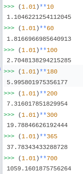
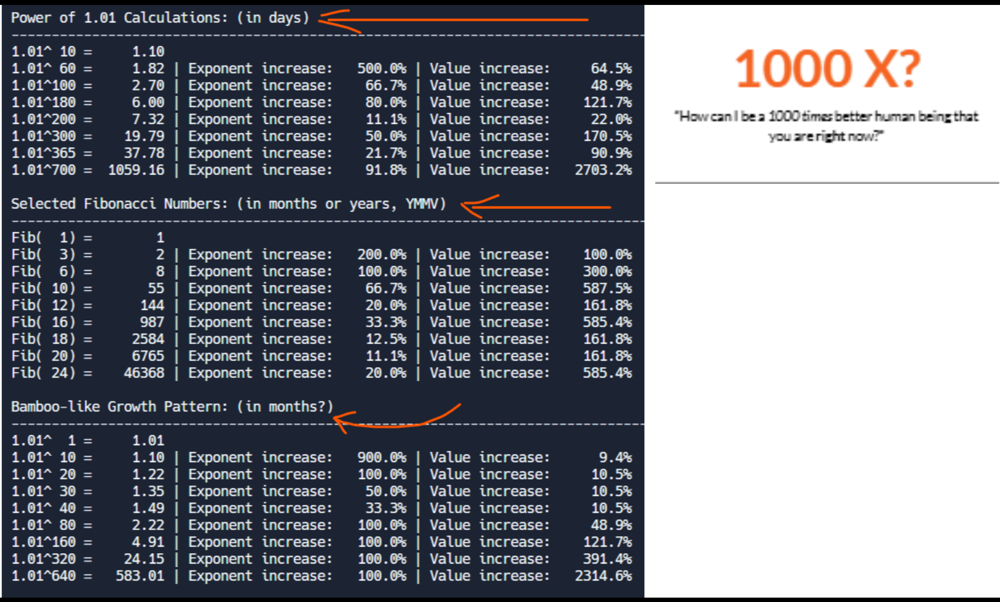

# Growth Patterns: Power Series vs Fibonacci Sequence

This program demonstrates and compares two fascinating mathematical growth patterns: compound growth (using powers of 1.01) and the Fibonacci sequence. It calculates and displays the progression of both series along with their respective growth rates.

## What the Program Does

1. **Power Series Calculations (1.01^n)**
   - Calculates powers of 1.01 for specific exponents: 10, 60, 100, 180, 200, 300, 365, and 700
   - Shows the percentage increase between consecutive exponents
   - Displays the corresponding percentage increase in values

2. **Fibonacci Sequence**
   - Generates Fibonacci numbers for positions: 1, 3, 6, 10, 12, 16, 18, 20, and 24
   - Calculates percentage increases in both position and values
   - Demonstrates the explosive growth pattern of the sequence

## Analysis: Power vs Fibonacci Growth

### Power Series (1.01^n)
The power series represents consistent, compound growth. Starting with a small base (1.01):

- After 60 days: 1.82x growth
- After 180 days: 6.00x growth
- After 365 days: 37.78x growth
- After 700 days: 1059.16x growth

This pattern shows that small, consistent actions (just 1% improvement) can lead to massive results over time.

### Fibonacci Sequence
The Fibonacci sequence shows a different kind of growth:

- Initially slower (first few numbers: 1, 1, 2, 3, 5, 8...)
- Accelerates dramatically (by position 24: 46,368)
- Shows consistent value increases of about 161.8% at regular intervals

## Motivational Insights for Habit Building

### The 1% Rule (Power Series)
The power series (1.01^n) perfectly illustrates the "1% better every day" principle. Just like in the program:

- A mere 1% daily improvement leads to a 37.78x improvement in one year
- This mirrors how small, consistent habits compound over time
- Even on days when progress seems minimal, the compound effect is working

### The Fibonacci Pattern of Skill Development
The Fibonacci sequence reflects how skills and habits often develop:

- Initial progress may seem slow (like the early Fibonacci numbers)
- As fundamentals stack up, growth accelerates dramatically
- Each new achievement builds on previous ones, creating exponential progress

### Key Takeaways for Habit Building
1. **Trust the Process**: Like the power series shows, small daily improvements (1%) lead to massive yearly gains
2. **Expect Non-Linear Progress**: The Fibonacci pattern reminds us that growth often accelerates after establishing foundations
3. **Consistency Beats Intensity**: Both sequences demonstrate that regular, sustained effort outperforms sporadic large efforts
4. **The 365-Day Perspective**: The power series shows that one year of 1% improvements leads to nearly 38x growth

Remember: Whether you're coding daily, exercising, or building any other habit, you're following these mathematical patterns of growth. Every small step compounds, just like 1.01^n, and every skill builds upon previous ones, just like the Fibonacci sequence.

## The Bamboo Tree Growth Pattern

The power series (1.01^n) closely mirrors the fascinating growth pattern of the Chinese bamboo tree, which offers a powerful metaphor for personal development:

- For the first 4-5 years, the bamboo shows virtually no visible growth above ground
- In the fifth year, it suddenly grows up to 90 feet in just 5-6 weeks
- This mirrors our power series where:
  - Initial growth (first 60 days) seems modest (1.82x)
  - Later growth (700 days) shows explosive results (1059.16x)

### Generating Similar Growth Patterns
To explore bamboo-like growth patterns in our program:

1. Modify the exponents list to include more early-stage values (1-50)
2. Add a dramatic jump point (around day 300-365)
3. Include final explosive growth points (700+)

Example sequence:
```python
exponents = [1, 10, 30, 50, 300, 365, 700]
```

This will demonstrate the "hidden growth" period followed by dramatic visible results, just like the bamboo tree's growth pattern.

For a visual understanding of this remarkable growth pattern, watch this short video:
[Chinese Bamboo Tree - The Power of Patience and Persistence](https://www.youtube.com/watch?v=KN9d6QQnIIM)

## History

This project's evolution was inspired by the power of mathematical patterns in personal growth. Here's our journey:

### Starting Point


We began with a simple visualization of compound growth, demonstrating how small, consistent improvements lead to significant results over time.

### Final Implementation


The project evolved to include multiple growth patterns - Power Series, Fibonacci Sequence, and the Bamboo Tree growth model - providing a comprehensive view of different growth trajectories and their implications for personal development.
